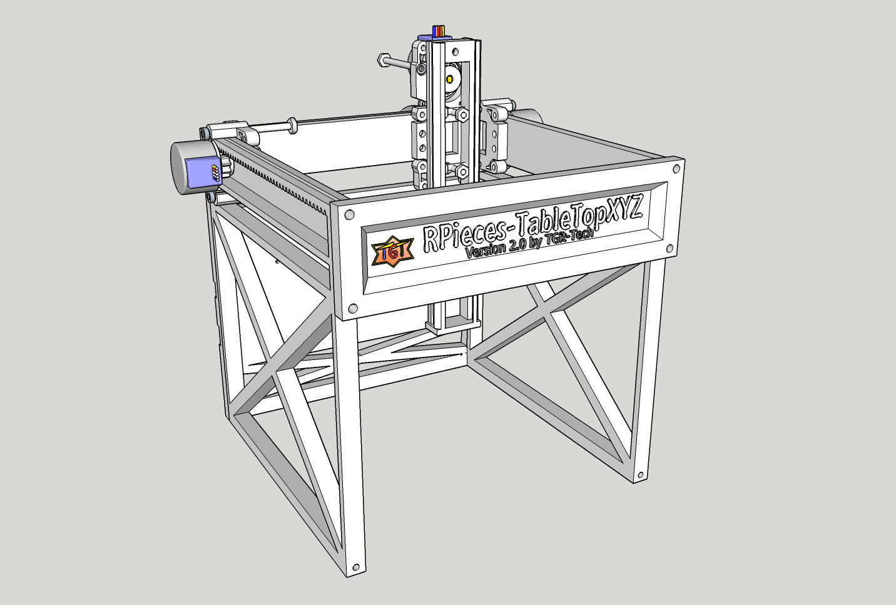
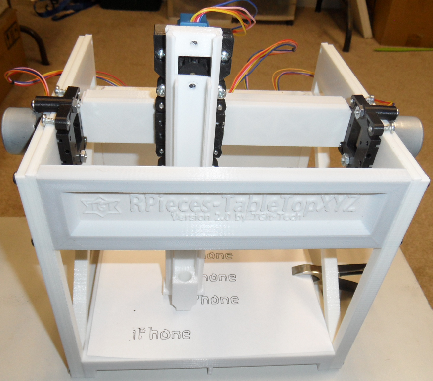
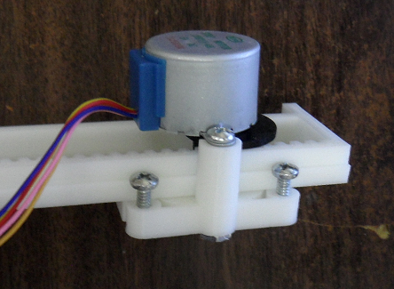
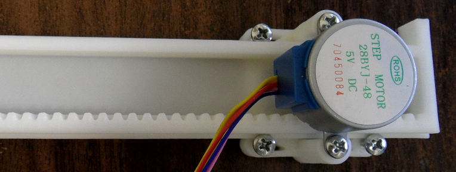

-----------------------------------------------------------------------------------
# RPieces-TableTopXYZ
-----------------------------------------------------------------------------------
A Simple and Printable TableTop XYZ Motion Frame using 28BYJ-48 Unipolar Stepper
Motors.

The RPieces TableTopXYZ Frame is a project that will attempt to create a simple one
day build of an all in one 3D Printer, Mill, and Plotter.  The project will minimize
the use of linear bearings in place of 3D Printed Rails and minimize the use of 
timing belts in place of 3D-Printed Pinions ( Thus the R.=Rack & P.=Pinion 
abbreviation in RPieces naming convention )

Example Video @ https://www.youtube.com/watch?v=2BT0keDggYo

-----------------------------------------------------------------------------------
#Project Status
-----------------------------------------------------------------------------------
This is RPieces-TableTopXYZ Version 2.0 Beta;  Version 1.0 was released previously.
Unless issues occur this will be the final Version 2.0

Version 2.0 enhancements include a much more stable frame & carriages.  As can be
seen by the video; the prints are still quite sloppy but the test model was printed
using extremely soft plastic on the carriages.  I'd suggest a little harder plastic
on the carriages than originally suggested in the User Manual.

-----------------------------------------------------------------------------------
#Cost and Materials
-----------------------------------------------------------------------------------
Building this project requires

    - (1) 3D Printer with a build surface of at least 190mm x 190mm   ... $N/A
    - (1) Arduino UNO or NANO / half breadboard / jumper kit          ... $ 6.95
    - (4) 28BYJ-48 Stepper Motors with ULN2003 Drivers                ... $ 9.90
    - (~20) Male to Female Dupont jumpers                             ... $ 1.60
    - (1) 5Vdc Wall-module Power Supply adapter at ~2A                ... $ 2.15
    - (12) #6-32 x 1/2" Long Machine Screws                           ... $ 0.24
    - (10) #6-32 x 3/4" Long Machine Screws                           ... $ 0.20
    - (8) #6-32 x 1-1/2" Long Machine Screws                          ... $ 0.16
    - (7) #6-32 x 3/4" Long Machine Screws                            ... $ 0.14
    - (2) #6-32 x 1-1/2" Long Machine Screws                          ... $ 0.06
    - (24) #6 x 3/4" Sheet Metal Screws                               ... $ 0.48
    - (20) #4 x 3/8" Sheet Metal Screws                               ... $ 0.40
    - (10) Corresponding hex nuts (#6) for machine screws             ... $ 0.20
    - Modified GRBL Firmware @ https://github.com/tgit23/GRBL-28byj-48
    - Grbl Controller Software @ http://zapmaker.org/projects/grbl-controller-3-0/

TOTAL ESTIMATED COST (including filament): $33.93
Detailed items/cost inside the Assembly document linked below.

-----------------------------------------------------------------------------------
#Getting Started
-----------------------------------------------------------------------------------
Assembly document can be found @ https://github.com/tgit23/RPieces-TableTopXYZ/blob/master/docs/RPieces-TableTopXYZ-Version2-User-Assembly.pdf

I.e. /docs/RPieces-TableTopXYZ-Version2-User-Assembly.pdf

Before trying to control the model;  Setup the parameters of 'grbl' firmware through
the 'grbl controller' command interface by entering the following commands.

    - $0=30
    - $100=100
    - $101=100
    - $102=100
    - $110=550
    - $111=550
    - $112=550
    - $120=100
    - $121=100
    - $122=100
    
You can now load a file from the \nc-examples folder into grbl controller for unit
testing.

-----------------------------------------------------------------------------------
CONTRIBUTING
-----------------------------------------------------------------------------------
Anyone interested in joining this project can email
tgit28@gmail.com with a return email address.  Details of what can
be done and what needs done can be negotiated from there.

We'd really appreciate any extra man-power we can gather..
