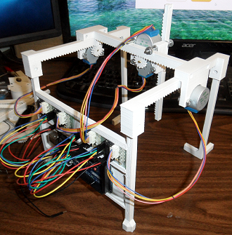

-----------------------------------------------------------------------------------
# RPieces-TableTopXYZ
-----------------------------------------------------------------------------------
A Simple and Printable TableTop XYZ Motion Frame using 28BYJ-48 Unipolar Stepper
Motors.

The RPieces TableTopXYZ Frame is a project that will attempt to create a simple one
day build of an all in one 3D Printer, Mill, and Plotter.  The project will minimize
the use of linear bearings in place of 3D Printed Rails and minimize the use of 
timing belts in place of 3D-Printed Pinions ( Thus the R.=Rack & P.=Pinion 
abbreviation in RPieces naming convention )

-----------------------------------------------------------------------------------
#Project Status
-----------------------------------------------------------------------------------
RPieces-TableTopXYZ is still in a development phase and has no official releases.  

-----------------------------------------------------------------------------------
#ABOUT
-----------------------------------------------------------------------------------
The project currently utilizes

    - Arduino UNO microcontroller
    - (4) 28BYJ-48 Stepper Motors with ULN2003 Drivers
    - Modified GRBL Firmware ( see https://github.com/tgit23/GRBL-28byj-48-Servo )
    - Grbl Controller Software ( see http://zapmaker.org/projects/grbl-controller-3-0/ )

You can load a file from the \nc-examples folder into grbl controller for controller
testing.

Example Video @ https://youtu.be/4aUQkjFIM5M

-----------------------------------------------------------------------------------
CONTRIBUTING
-----------------------------------------------------------------------------------
Anyone interested in joining this project can email
tgit28@gmail.com with a return email address.  Details of what can
be done and what needs done can be negotiated from there.

We'd really appreciate any extra man-power we can gather..