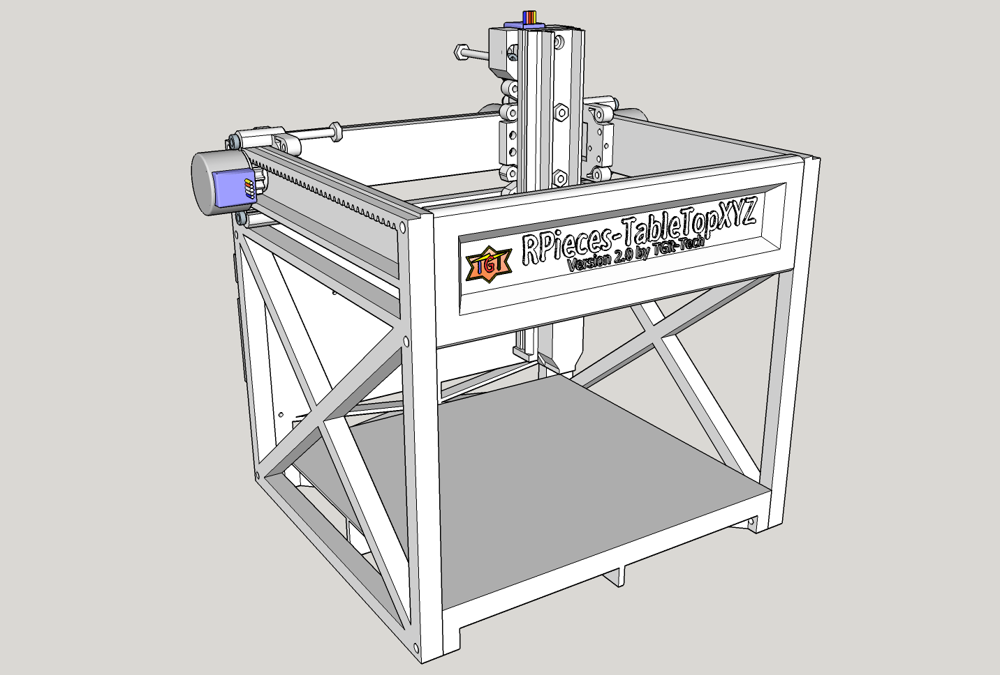

-----------------------------------------------------------------------------------
# RPieces-TableTopXYZ
-----------------------------------------------------------------------------------
A Simple and Printable TableTop XYZ Motion Frame using 28BYJ-48 Unipolar Stepper
Motors.

*NOTE: Images show Version 2.0 although not yet released completely.  Please check
back soon or use RELEASED VERSION 1.0 in the Released Tab.*

The RPieces TableTopXYZ Frame is a project that will attempt to create a simple one
day build of an all in one 3D Printer, Mill, and Plotter.  The project will minimize
the use of linear bearings in place of 3D Printed Rails and minimize the use of 
timing belts in place of 3D-Printed Pinions ( Thus the R.=Rack & P.=Pinion 
abbreviation in RPieces naming convention )

-----------------------------------------------------------------------------------
#Project Status
-----------------------------------------------------------------------------------
RPieces-TableTopXYZ Version 2.0 is currently in a development phase and has not
officially been released.  Please use RELEASED VERSION 1.0 for the time being until
the new version is tested and documentation is updated.

Version 2.0 should be worth waiting for.  The biggest enhancement is with the Racks
and how they slide; using the very end of the screw latched over a tab-out instead
of just using the threaded part and nut as in Version 1.0.  I've been very happy 
with how tight and still easily slide-able the setup is and also easily adjustable.

I've dropped the initial and simple test example used of the new carriage slider
in the ToolHeads folder for those who want a quick demonstration.  There is no
gearing or place for a motor - just a simple carriage and short rail.  Using (4) #6 
machine screws.

Most of the models for Version 2.0 have been created and pictures can be seen in
the images folder.  I believe the models are done enough to make a
working machine but I have yet to actually have one built to test and make sure
everything fits together yet and there is no documentation for it.  Hope to have it
done in a month.

-----------------------------------------------------------------------------------
#Cost and Materials
-----------------------------------------------------------------------------------
Building this project requires

    - (1) 3D Printer with a build surface of at least 190mm x 190mm   ... $N/A
    - (1) Arduino UNO microcontroller / half breadboard / jumper kit  ... $10.19
    - (4) 28BYJ-48 Stepper Motors with ULN2003 Drivers                ... $10.34
    - (~20) Male to Female Dupont jumpers                             ... $ 2.20
    - (1) 5Vdc Wall-module Power Supply adapter at ~2A                ... $ 3.10
    - (4) #6-32 x 2" Long Machine Screws or equivalent                ... $ 0.24
    - (8) #6-32 x 1-1/4" Long Machine Screws or equivalent            ... $ 0.40
    - (4) #6-32 x 3/4" Long Machine Screws or equivalent              ... $ 0.20
    - (26) Corresponding hex nuts (#6) for machine screws             ... $ 1.30
    - Modified GRBL Firmware @ https://github.com/tgit23/GRBL-28byj-48
    - Grbl Controller Software @ http://zapmaker.org/projects/grbl-controller-3-0/

TOTAL ESTIMATED COST (not including filament): $28.07
Detailed items/cost inside the Assembly document linked below.

-----------------------------------------------------------------------------------
#Getting Started
-----------------------------------------------------------------------------------
Assembly document can be found @ https://github.com/tgit23/RPieces-TableTopXYZ/blob/master/docs/RPieces-TableTopXYZ-User-Assembly.pdf

I.e. /docs/RPieces-TableTopXYZ-User-Assembly.pdf

Before trying to control the model;  Setup the parameters of 'grbl' firmware through
the 'grbl controller' command interface by entering the following commands.

    - $0=30
    - $100=100
    - $101=100
    - $102=100
    - $110=550
    - $111=550
    - $112=550
    - $120=100
    - $121=100
    - $122=100
    
You can now load a file from the \nc-examples folder into grbl controller for unit
testing.

Example Video @ https://youtu.be/4aUQkjFIM5M

-----------------------------------------------------------------------------------
CONTRIBUTING
-----------------------------------------------------------------------------------
Anyone interested in joining this project can email
tgit28@gmail.com with a return email address.  Details of what can
be done and what needs done can be negotiated from there.

We'd really appreciate any extra man-power we can gather..
